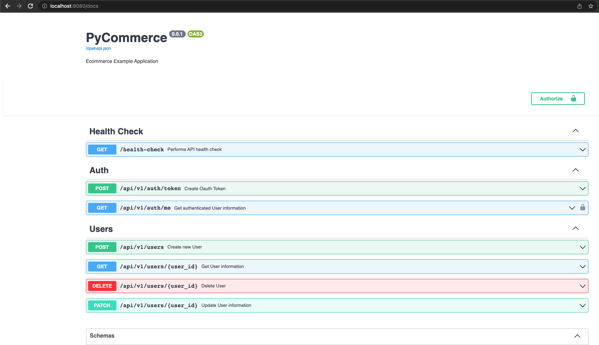
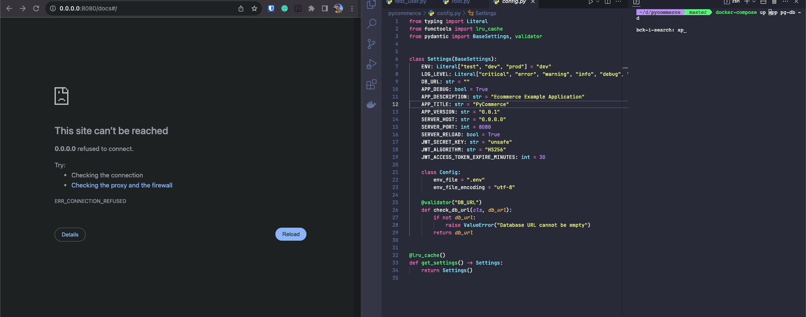
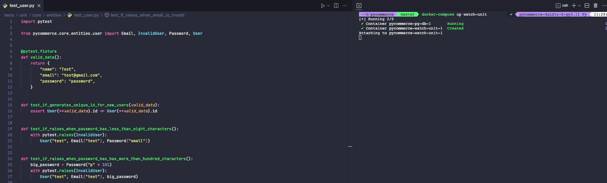

# Pycommerce

## Overview (Work in Progress)

<p align="left">
  <a href="https://skillicons.dev">
    
  </a>
</p>

`Pycommerce` is an ecommerce example application intentionally designed to showcase how a _medium-sized_ project structured with [DDD](https://en.wikipedia.org/wiki/Domain-driven_design), [TDD](https://en.wikipedia.org/wiki/Test-driven_development), and [Clean Architecture](https://blog.cleancoder.com/uncle-bob/2012/08/13/the-clean-architecture.html) looks using the best of modern Python.

Although it's not a fully-featured real-world ecommerce application, it serves as an inspiration project that can be easily extended. It features:

- Language: [Python 3.12](https://www.python.org/)
- Container: [Docker](https://www.docker.com/), and [Docker Compose](https://docs.docker.com/compose/)
- Package management: [Poetry](https://python-poetry.org/)
- Web framework: [FastAPI](https://fastapi.tiangolo.com/)
- Web server: [Uvicorn](http://www.uvicorn.org/)
- Database: [Postgres](https://www.postgresql.org/)
- Database migrations: [Alembic](https://alembic.sqlalchemy.org/en/latest/)
- ORM: [SQLModel](https://sqlmodel.tiangolo.com/)
- Password hashing: [Passlib](https://passlib.readthedocs.io/)
- Authentication: [OAuth2 + JWT](https://fastapi.tiangolo.com/tutorial/security/oauth2-jwt/)
- Testing: [Pytest](https://docs.pytest.org/en/latest/)
- Linter: [Ruff](https://github.com/astral-sh/ruff)
- Type checker: [Mypy](https://mypy.readthedocs.io/en/stable/index.html)
- Code formatter: [Black](https://github.com/psf/black)
- Local [development hot reload](#hot-reload), [watch](#watch-mode-for-tests) mode for tests, full [Asyncio](https://docs.python.org/3/library/asyncio.html) support, etc...

Don't forget to check the [FAQ](docs/FAQ.md) for more information about the project's structure and design decisions.

## Usage

While it's possible to run the application locally just using Python, it's highly recommended to install [Docker](https://www.docker.com/) to keep your local environment clean and facilitate the use of all the features.

### Configuration

`Pycommerce` uses environment variables for configuration. You can check all the available options [here](pycommerce/config.py). You can create and fill a `.env` file using the [.env.example](.env.example) file as a reference, or set them manually like this:

```sh
export DB_URL="<database_url>"
export JWT_SECRET_KEY="<my_super_secret_key>"
...
```

If using Docker, just edit the environment variables on [docker-compose.yml](./docker-compose.yml).

### Installing

Activate your Python [virtual environment](https://docs.python.org/3/library/venv.html) and run:

```sh
poetry install

# or

pip install .
```
### Type Checking

```sh
mypy pycommerce tests
```

### Linting

```sh
ruff check .
```

### Code Formatting

```sh
black --check pycommerce tests
```

### Starting the Application

⚠️ If not using Docker, remember to run the [init.sql](scripts/pg/init.sql) in your local database before running the application.

```sh
# set the DB_URL env var to point to the dev database, and run
alembic upgrade head && poetry run app

# or
alembic upgrade head && python -m pycommerce

# with Docker (optionally, you can add pg-admin to the list of containers)
docker-compose up app pg-db -d
```

Then, open the browser on [http://localhost:8080/docs](http://localhost:8080/docs) to see the OpenAPI docs:



### Tests

```sh
# to run all the tests
pytest

# to run only the unit tests
pytest tests/unit/

# to run only the integration tests
pytest tests/integration/

# with Docker
docker-compose up tests
```

## Development Workflow

### Hot Reload

By [default](/pycommerce/config.py#16), hot reload is configured independently of whether you're using Docker or not, so you can have faster development feedback like this:



### Watch Mode for Tests

Tests can also be triggered automatically whenever a test file is modified due to the use of [pytest-watch](https://pypi.org/project/pytest-watch/), which leads to a nice and efficient TDD workflow:



For other options, you can use:

```sh
# to watch all project tests
docker-compose up watch

# to watch only the ingration tests
docker-compose up watch-integration

# without Docker
ptw -w -c tests/
ptw -w -c tests/unit/
ptw -w -c tests/integration/
```

## License

This project is licensed under the MIT License - see the [LICENSE](LICENSE) file for details.
